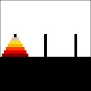

The game of _Tower of Hanoi_ consists of a stack (on the left) of discs of different sizes, sorted from the largest (at the bottom) to the smallest (at the top), as well as two empty stacks (in the middle and on the right).

The goal is to move all the discs from the left stack to the right stack, one by one, without ever stacking a larger disc on top of a smaller one.



We define the following sum type representing the three towers (left, middle, and right):
```ocaml
type tower = L | M | R
```

---

**Question 1**

Write a function `move: tower -> tower -> unit` that takes two towers as input and displays the corresponding move on the standard output.
Specifically, it should display a line of the form `"tower1 -> tower2"` where `tower1` and `tower2` can be `left`, `middle`, or `right`.

To do this, you can use the function `print_string: string -> unit`, which prints a string to the standard output, as well as the function `print_newline: unit -> unit`, which prints a newline.

**Syntax**:
You can use the following syntax. If `e1` is an expression of type `unit`, then `e1 ; e2` is an expression of the same type as `e2`, equivalent to:
```ocaml
let _ = e1 in e2
```
**Example**:
```ocaml
print_string "Hello";
print_string " ";
print_string "world"
```

---

**Question 2**:
Using only `move`, write a function `tower3: unit -> unit` that displays, line by line, the moves necessary to solve the Tower of Hanoi with three discs.

---

**Question 3**:
Write a function `solve_tower: int -> unit` that displays the solution for the Tower of Hanoi problem with `n` discs, where `n` is the parameter of the function.

**Note**:
There is nothing to do to solve the problem without any discs.

**Hint**: We can observe that to solve the problem with `n + 1` discs, we must first move the `n` smallest discs to the middle tower, then move the largest disc to the right tower, and finally move the remaining `n` discs to the right tower. In this way, the largest disc never obstructs the movement of the other discs.

You can start by defining a recursive function of type `int -> tower -> tower -> tower -> unit` that, given the inputs `n`, `t1`, `t2`, and `t3`, solves the problem with `n` discs placed on tower `t1`, to be moved to tower `t3` using tower `t2`.
